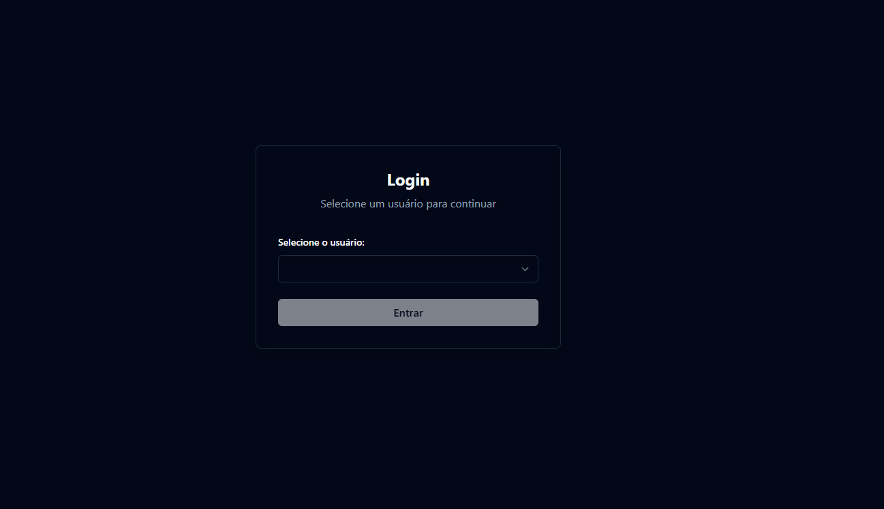
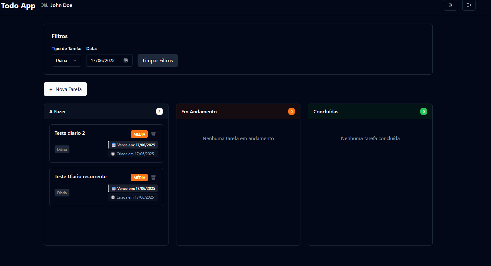
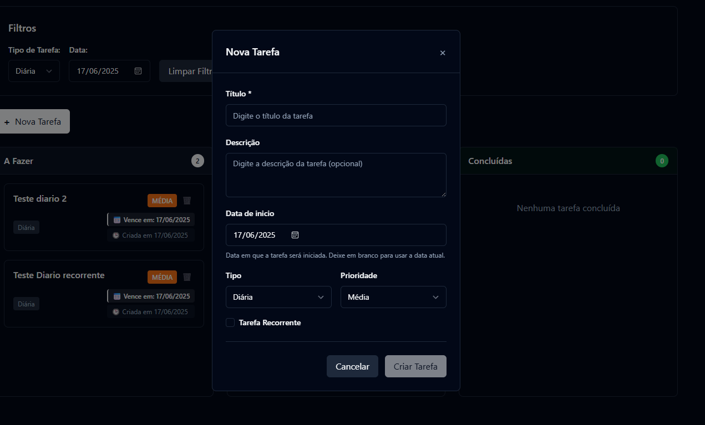
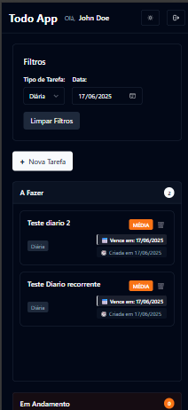

## 🗺️ Roadmap - Todo List Application

Este projeto tem como objetivo criar um sistema de **gerenciamento de tarefas** (Todo List) com foco em produtividade, organização e usabilidade. As tarefas podem ser diárias, semanais ou mensais.

---

## 🚀 Como Executar o Projeto

### Pré-requisitos
- **Docker** instalado e em execução

### Executando a Aplicação

1. Clone o repositório
2. Navegue até a pasta do projeto
3. Execute o comando:

```bash
docker-compose up -d --build
```

### URLs da Aplicação

- **Frontend**: http://localhost:5000/login
- **Backend (Swagger)**: http://localhost:8080/swagger/index.html

---

## 🎬 Demonstração do Sistema

### Vídeo de Apresentação

<div align="center">
  <a href="https://youtu.be/faT2m05t-yU" target="_blank">
    
  </a>
</div>

### Screenshots do Sistema

#### 🖥️ Tela de Login


#### 📋 Dashboard Principal


#### ➕ Modal de Criação de Tarefa


#### 📱 Visualização Mobile


### Funcionalidades Demonstradas

- ✅ **Login rápido** com usuários pré-cadastrados
- ✅ **Criação de tarefas** com data de início personalizada
- ✅ **Drag & Drop** para alterar status das tarefas
- ✅ **Filtros por tipo** (Diária, Semanal, Mensal)
- ✅ **Tarefas recorrentes** com data de fim
- ✅ **Checklists** para subtarefas
- ✅ **Modo escuro/claro** com toggle
- ✅ **Interface responsiva** para mobile

---

## 🧪 Como Testar o Sistema

Para facilitar os testes, foram criados **10 usuários de teste** no sistema. Você pode usar qualquer um deles para fazer login sem precisar criar uma nova conta.

### Usuários de Teste Disponíveis:
- **John Doe**
- **Jane Smith**
- **Michael Johnson**
- **Emily Davis**
- **Robert Wilson**
- **Sarah Brown**
- **David Miller**
- **Lisa Taylor**
- **James Anderson**
- **Jennifer Thomas**

### Como Fazer Login:
1. Acesse: http://localhost:5000/login
2. No dropdown de seleção de usuário, escolha qualquer um dos 10 usuários disponíveis
3. Clique em "Entrar" para acessar o sistema

---

## 🛠️ Tecnologias Utilizadas

- ASP.NET Core (.NET 8)
- Angular
- PostgreSQL
- Entity Framework Core
- MediatR (arquitetura CQRS)

---

## ✅ Features Implementadas

### 🎯 Funcionalidades Básicas (MVP)
- [x] Login de usuários
- [x] CRUD de tarefas (criar, editar, concluir, excluir)
- [x] Campos da tarefa: título, descrição, tipo (diária/semanal/mensal), data de vencimento, prioridade
- [x] Visualização das tarefas por período (diário, semanal, mensal)
- [x] Filtros por tipo e data
- [x] Alteração de status da tarefas (arrastar e soltar)

### 🔄 Organização e Automação
- [x] Tarefas recorrentes (diária, semanal, mensal)
- [x] Subtarefas (checklists)

### 🎨 Personalização
- [x] Temas personalizados (modo claro/escuro, cores)

### 🧪 Testes e Qualidade
- [x] Documentação da API com Swagger
- [x] Tratamento global de exceções
- [x] Testes unitários com xUnit e Moq

---

## 🚧 Features Futuras

### 🔔 Organização e Automação (Pendentes)
- [ ] Lembretes e notificações
- [ ] Barra de progresso por dia, semana e mês
- [ ] Histórico de tarefas concluídas
- [ ] Cancelamento de recorrência

### 👥 Colaboração
- [ ] Compartilhamento de tarefas com outros usuários
- [ ] Comentários nas tarefas
- [ ] Listas compartilhadas entre usuários (família, time, casal)

### 🤖 Inteligência e Personalização
- [ ] Sugestões automáticas com base no uso
- [ ] Estatísticas de produtividade
- [ ] Integração com Google Calendar / Outlook

## 🤖 Desenvolvimento com Inteligência Artificial

Este projeto foi desenvolvido com o auxílio de diferentes ferramentas de IA, demonstrando como a tecnologia pode acelerar e melhorar o processo de desenvolvimento de software.

### 📋 Fase 1: Planejamento e Roadmap
- **Ferramenta**: ChatGPT
- **Objetivo**: Criar um roadmap completo como um Product Owner
- **Resultado**: Roadmap detalhado com funcionalidades, tecnologias e arquitetura definidas
- **Benefício**: Visão clara do projeto desde o início, evitando refatorações futuras

### 🔧 Fase 2: Desenvolvimento da API
- **Ferramenta**: ChatGPT
- **Objetivo**: Implementar CRUD básico com toda configuração da API
- **Resultado**: API completa com Entity Framework, MediatR, CQRS e Swagger
- **Benefício**: Código limpo e bem estruturado seguindo boas práticas

### 🎨 Fase 3: Frontend e Integração
- **Ferramenta**: Cursor (AI-powered IDE)
- **Objetivo**: Gerar telas e integrar backend com frontend
- **Resultado**: Interface Angular completa com integração total
- **Benefício**: Desenvolvimento rápido com código de qualidade

### 📚 Fase 4: Documentação
- **Ferramenta**: Cursor
- **Objetivo**: Reorganizar e melhorar o README
- **Resultado**: Documentação profissional e completa
- **Benefício**: Projeto bem documentado para futuras manutenções

### 🎯 Benefícios do Desenvolvimento com IA

- **🚀 Velocidade**: Desenvolvimento 3x mais rápido
- **📈 Qualidade**: Código seguindo padrões e boas práticas
- **🧠 Aprendizado**: Compreensão mais profunda das tecnologias
- **🔄 Iteração**: Refinamento rápido de funcionalidades
- **📖 Documentação**: Código auto-documentado e README profissional

### 💡 Lições Aprendidas

1. **IA como Parceiro**: Não substitui o desenvolvedor, mas potencializa suas capacidades
2. **Revisão Importante**: Sempre revisar e entender o código gerado
3. **Iteração Contínua**: Usar IA para refinar e melhorar funcionalidades
4. **Documentação**: Manter documentação atualizada com ajuda da IA
5. **Arquitetura**: Planejamento inicial bem feito facilita todo o desenvolvimento

---
